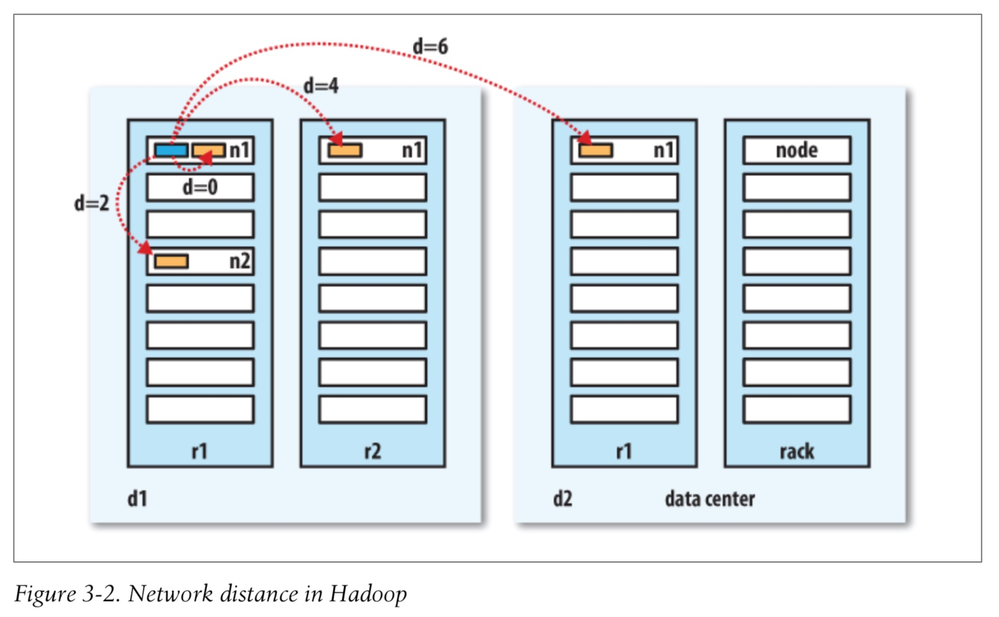
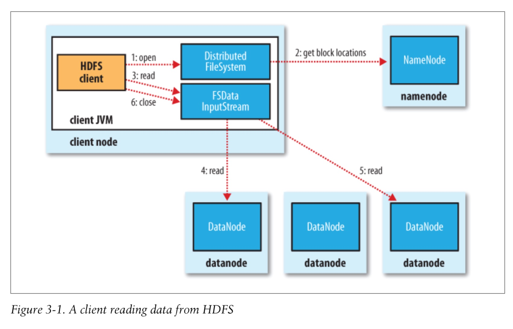
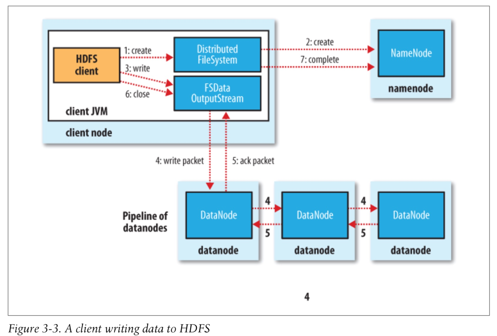
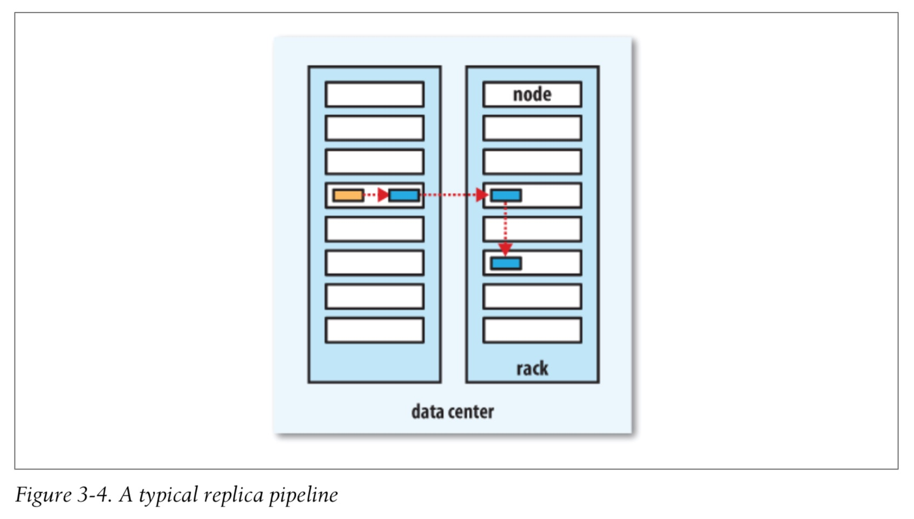

# 3. 하둡 분산 파일시스템

- DFS: 네트워크로 연결된 여러 머신의 스토리지를 통합관리하는 시스템
- 하둡은 **범용 파일시스템** 을 추구 => 추상화
    - 로컬 파일시스템이나 S3와 같은 다른 스토리지 시스템까지 통합


## 3.1. HDFS 설계
#### HDFS의 설계 특성
- 매우 큰 파일
- 스트리밍 방식의 데이터 접근
- 범용 하드웨어

#### HDFS가 어울리지 않는 응용 분야
- 빠른 데이터 응답시간
- 수많은 작은 파일 [HDFS Scalability: The Limits to growth](http://bit.ly/limits_to_growth)
- 다중 라이터와 파일의 임의 수정


## 3.2. HDFS 개념
### 3.2.1. 블록
- Block size: 한 번에 읽고 쓸 수 있는 데이터의 최대량
- HDFS에서는 한 블록의 단위가 큼 (기본 128M) [CM](http://mobility-hadoop-cm1.dakao.io:7180/cmf/services/7/config#filterfreeText=block)
- HDFS의 파일은 블록 단위의 chunk로 쪼개지고, 각 chunk는 독립적으로 저장
- 디스크 점유
    - 단일 디스크를 위한 F/S에서는 디스크 블록 크기보다 작은 데이터라도 한 블록 전체를 점유
    - HDFS는 block size보다 작은 데이터인 경우에도 전체 블록 크기의 하위 디스크를 모두 점유하지 않음

> **HDFS 블록이 큰 이유는?**
> - 탐색 비용의 최소화 => 블록의 시작점을 탐색하는 비용 절감

#### 블록 추상화
- 파일 하나의 크기가 단일 디스크의 용량보다 더 커질 수 있음
- 스토리지의 서브시스템을 **단순하게 구성** 가능
- fault tolerance & High availability 를 제공하는 데 필요한 Replication 구현에 적합

##### HDFS 의 각 파일을 구성하는 블록의 목록을 출력하는 명령어
```bash
hdfs fsck /user/curry-ing -files -blocks
```

### 3.2.2. 네임노드 & 데이터노드
#### Namenode
- F/S의 Namespace를 관리
- HDFS의 트리 및 트리에 포함된 모든 파일과 디렉터리에 관한 메타데이타 유지
- 파일이 속한 블록의 데이터노드 상 위치 역시 파악
    - 위치정보는 시스템 구동시 DN으로부터 받아 재구성하기 떄문에 영속적으로 저장하지는 않음

#### Datanode
- NN의 요청을 받아 블록을 저장 및 탐색하며, 가지고 있는 블록의 목록을 주기적으로 NN에 보고

#### Fault tolerance
- HDFS의 메타데이터를 파일로 백업
    - 로컬 디스크와 원격의 NFS마운트 두 곳에 동시 백업을 권장
- **Secondary Namenode** 운영
    - Primary NN과는 조금 다르게 동작
    - **주 역할**: edit-log가 너무 커지지 않도록 주기적으로 namespace image를 edit-log와 병합?
    - Primary NN 의 장애에 대비하여 namespace image의 복제본을 보관 (하지만 시간차가 있어, 장애시 불완전 복구 가능성)
> edit log: Oracle의 Archive log / MySQL의 binlog 같은 느낌, HDFS의 클라이언트가 쓰기동작 관련 내용을 모두 기록


### 3.2.3. 블록 캐싱
- 빈번하게 접근되는 블록은 off-heap **block cache**라는 DN의 메모리에 명시적으로 캐싱 가능
- 기본적으로 블록은 하나의 데이터노드 메모리에만 캐싱되지만, 파일 단위로도 설정 가능
- 잡 스케줄러(map-reduce, spark ...)는 블록이 캐싱된 데이터노드에서 태스크 실행 가능 => 읽기 성능 향상 (Join 등)
- 사용자나 Application 단에서 특정 파일 캐싱 명령 가능 (cache-pool 에 cache directive 추가)
    - cache pool: 캐시 권한이나 자원의 용도를 관리하는 그룹의 역할 담당

### 3.2.4. HDFS 페더레이션
- NN은 파일과 블록 정보를 메모리에 올려두고 관리함 => 대형 클러스터의 추가 확장시 문제
- HDFS Federation 을 활용해, 각각의 네임노드가 HDFS의 namespace 일부를 나누어 관리하는 방식으로 새 NN 추가 가능
    - **NN-a** 는 `/user` 를 관장하고 **NN-b**는 `/data`를 관리하는 식으로 역할 분담
- 적용시 각 NN의 역할: namespace volume과 block pool 관리
    - **Namespace Volume**: namespace의 메타데이터를 구성
        - namespace volume은 각각 독립되어 있어 서로 통신할 필요가 없고, 특정 NN장애시에도 다른 NN의 가용성에 영향없음
    - **Block pool**: namespace에 포함된 전체 블록을 보관
        - block pool의 저장소는 독립되어있지 않음
    - 각 DN은 클러스터의 각 NN마다 등록되어있고, 여러 block pool로부터 블록을 저장

- Client는 파일 경로와 NN을 매핑한 클라이언트 측 마운트 테이블을 이용하여 접근
     - 환경 설정에서 `ViewFileSystem`과 `viewfs://` URI를 사용하여 관리

### 3.2.5. HDFS 고가용성
#### 고가용성을 위한 노력의 흔적
1. 네임노드 메타데이터를 다수의 FS에 복제
2. Secondary NN => checkpoint 생성

#### 현실은 여전히NN은 SPOF
- 장애 발생시 모든 클라이언트가 파일을 읽거나 쓸 수 없음
- 메타데이터와 block의 매핑 정보를 보관하는 유일한 장소

#### 장애 복구 시나리오
- HDFS 메타데이터 복제본을 가진 새 NN을 구동 후 모든 DN에 전파
- 새 NN구동시 downtime이 짧지 않음
    1. namespace image를 메모리에 로드
    1. edit log 갱신
    1. 전체 DN에서 충분한 블록 리포트를 받아 안전 모드를 벗어나는 과정 필요

- 하지만, NN에 장에가 발생할 확률은 극히 드물고...(서버가 내려가기라도 하면?)
- 실무에서는 계획된 downtime을 최소화 하는것이 더 중요

#### HDFS HA
- 2.x 릴리즈부터 적용
- active-standby 상태의 한 쌍의 NN으로 구성 [CM](http://mobility-hadoop-cm1.dakao.io:7180/cmf/services/7/instances?filterRoleType=NAMENODE&enableHistoricalMode=true#filterroleType=NAMENODE)
- active에 장애 발생시 standby가 그 역할을 이어받아 큰 중단 없이 장애 처리
- HA를 위한 HDFS 변경
    - NN은 고가용성 공유 스토리지 사용 필수(edit log를 공유)
    - DN은 블록 리포트를 두 개의 NN에 보내야 함 (블록 매핑 정보는 디스크가 아닌 NN의 메모리에 저장되기 때문)
    - client는 NN장애를 사용자에게 투명한 방식으로 처리할 수 있도록 구성(무슨 이야기지?)
    - standby는 secondary의 역할을 포함하고 있으며, active namespace의 체크포인트 작업을 주기적으로 수행

##### QJM(Quorum Journal Manager)
- 고가용성 공유 스토리지 옵션 중 하나(다른 하나는 NFS필러)
- HDFS 전용 구현체로 고가용성 edit log를 지원하기 위한 목적으로 설계됨
- HDFS의 **권장 옵션**
- **저널 노드** 그룹에서 동작
    - Journal Node는 3개로 구성되며 이 중 하나가 손상되어도 큰 문제가 없도록 구현
- 각 edit log는 전체 **Jounal Node**에 동시에 쓰여짐
- Zookeeper의 작동 방식과 매우 유사하지만 QJM은 zk없이 이런 기능을 구현

#### 장애 복구 시나리오
- active NN에 장애 발생시 standby NN은 매우 빠르게 active로 전환 (수십 초 이내)
    - active와 standby는 모두 최신 edit log와 block 정보를 유지하기 때문
    - 하지만 실제 전환은 1분여 시간이 걸리는데, 이는 장애상황 판단에 매우 신중해야 하기 때문
- active가 down되었을 때 standby가 비활성 상태인 경우
    - 운영자가 인지 후 그냥 standby를 다시 올리면 됨
    - 하둡의 표준 운용 절차이며 HA 구성이 아닌 하둡에 비해 딱히 단점이 있는것도 아님

### 장애복구와 펜싱
##### 장애복구 컨트롤러(failover controller)
- standby를 활성화시키는 전환작업을 위한 객체
- 기본 구현체는 단 하나의 NN의 활성화를 보장하기 위해 ZK를 이용
- 각 NN은 경량의 failover controller process 로 NN의 장애를 감시하고 (hearbeat 방식) NN에 장애가 발생하면 failover를 시작

##### 우아한 장애복구(Graceful failover)
- 정기적인 유지관리를 위한 관리자의 수동 failover
- failover controller는 두 NN이 서로 역할을 바꾸게(active <-> standby) 하는 방식으로 전환 순서 제어

#### Fencing
- **Ungraceful failover**에서는 장애 상태의 NN이 현재 Down 상태임을 인지하기 어려움
- 고가용성 구현을 위해 기존의 active NN이 시스템을 손상시키거나 망가뜨리지 않도록 주의를 기울여야 하는데 이를 위한 메서드가 **펜싱(fencing)**

---
- **QJM**은 한 번에 하나의 NN만 edit log에 쓸 수 있도록 보장
- 하지만, 기존의 active NN이 client의 읽기 요청에 잘못 된 정보를 줄 가능성.
    - SSH fencing 명령으로 NN의 process를 확실히 kill할 필요가 있음
- **NFS 필러** 사용시에는 한 번에 하나의 NN만 허용하는것이 불가능 => 좀 더 강력한 fencing method 가 필요
    - QJM 권장 이유
- 다양한 펜싱 메커니즘
    - NN의 공유 스토리지에 대한 접근 차단
    - 네트워크 포트 차단
    - 최후의 수단: 기존 active NN에 대한 STONITH(Shot The Other Node In The Head, 헤드샷) => 별 거 아니고 호스트 머신의 전원을 내려버리는거 (PDU 사용)

##### Client의 장애복구
- Client library로 명확하게 처리 가능
- HDFS URI는 한 쌍의 NN주소를 매핑한 논리적인 호스트명을 사용하고, 성공시까지 각 네임노드의 주소로 연결을 시도


## 3.3 CLI: Command Line Interface
- 다양한 하둡 인터페이스 중 가장 간단하고 친숙한 방식
- 파일시스템은 URI로 정의 가능
    - HDFS 기본 포트: 8020

### 3.3.1 Basic FS Operations
##### `hadoop fs -help`
- 도움말 호출
- `hadoop fs`: 하둡 파일시스템의 쉘 명령어인 `fs`를 호출

##### `hadoop fs -ls`
```bash
% hadoop fs -mkdir books
% hadoop fs -ls .
Found 2 items
drwxr-xr-x   -   tom   supergroup     0   2009-04-02   22:41   /user/tom/books
-rw-r--r--   1   tom   supergroup   118   2009-04-02   22:29   /user/tom/quangle.txt
```
- 1열: 파일 모드
- 2열: 복제 계수 (Unix등의 시스템에는 없음)
    - 디렉터리는 DN에 저장되지 않고 NN에만 저장 및 메타데이터로 관리되므로 복제의 개념이 없음
- 3,4열: owner & group
- 5열: byte단위의 파일 크기(디렉토리의 경우 0)
- 6,7열: 마지막 수정 일시
- 8열: 절대경로 표시 이름


#### File Permissions in HDFS
- POSIX와 비슷한 방식의 권한 모델 (rwx)
- HDFS에서는 POSIX와 달리 파일의 실행을 지원하지 않으므로 실행 권한은 무시됨
    - 디렉터리에 대한 실행 권한은 하위 디렉터리의 접근에 사용
- 각 객체는 Owner, Group, Mode를 가짐
    - Mode는 owner, group-member, others 에 대한 권한으로 구성
- 권한 검사: `dfs.permissions.enabled`
    - 기본적으로 보안이 비활성화된 상태: 클라이언트의 사용자 계정을 인증하지 않음
    - 클라이언트가 보통 원격에 있기 때문에 원격 시스템에 계정을 하나 생성하면 쉽게 anonymous user가 될 수 있음
    - 이를 방지하기 위해 보안을 활성화: `dfs.permissions.enabled`
    - enabled되면, client의 username과 group에 따라 owner 혹은 group-member로 체크되며 아니면 others로 체크됨
    - NN 프로세스 식별자인 super-user 개념도 있음: SU에 대해서는 권한 체크를 따로 하지 않음

## 3.4 HDFS: Hadoop Distributed FileSystem
- Hadoop은 파일시스템의 추상화 개념을 가지고 있고 **HDFS는 그 구현체 중 하나**

#### 하둡 파일시스템
| Filesystem | URI | Java Class | 설명 |
| --- | --- | --- | --- |
| Local | `file` | `fs.LocalFileSyste` | 클라이언트 측 checksum을 사용하는 로컬 디스크를 위한 FS (checksum을 사용하지 않는 경우 `RawLocalFilesystem` 사용) |
| HDFS | `hdfs` | `hdfs.DistributedFileSystem` | 하둡 분산 파일시스템. Map-Reduce와의 효율적인 연동을 위해 구현 |
| WebHDFS | `webhdfs` | `hdfs.web.WebHdfsFileSystem` | HTTP를 통해 HDFS에 인증 FileSystem |
| Secure WebHDFS | `swebhdfs` | `hfds.web.SWebHdfsFileSystem` | WebHDFS의 HTTPS 버전 |
| HAR | `har` | `fs.HarFileSystem` | for archive. **HDFS의 `tar`**, `hadoop archive`로 생성 |
| View | `viewfs` | `viewfs.ViewFileSystem` | 다른 HDFS를 위한 클라이언트 측 마운트 테이블. 페더레이션 NN의 마운트 지점 생성시 주로 사용 |
| FTP | `ftp` | `fs.ftp.FTPFileSystem` | FTP 서버를 지원 |
| S3 | `s3a` | `fs.s3a.S3AFileSystem` | Amazon S3 지원, 구 버전의 s3n(S3 Native)를 대체 |
| Azure | `wasb` | `fs.aure.NativeAzureFileSystem` | Azure 지원 |
| Swift | `swift` | `fs.swift.snative.SwiftNativeFileSystem` | Openstack Swift 지원 |

- 하둡은 접근할 파일시스템을 위한 인터페이스를 제공하는데, 인스턴스 선택시 보통 URI Scheme을 사용


### 3.4.1 인터페이스
- JAVA API를 통한 하둡 파일시스템 연동이 쉬움(하둡이 Java로 작성되었기 때문)

#### HTTP
- Java로 작성되지 않은 Application도 HDFS에 접근을 용이하게 하기 위하여 구현
- WebHDFS를 이용한 HTTP REST API를 사용하여 HDFS에 접근
- Native Java Client보다는 느리므로 대량 파일 전송시 유의해야 함
- 두 가지 방식이 존재: 둘 다 `WebHDFS`프로토콜 사용
    1. client의 http요청을 HDFS데몬이 직접 처리
        - NN과 DN에 내장된 웹서버가 WebHDFS의 말단으로 작용
        - `dfs.webhdfs.enabled`, 기본값은 `true`
        - file에 대한 메타데이터 연산은 NN가 처리
        - file을 읽고 쓰는 연산은 먼저 NN으로 전달되고, NN은 파일 데이터를 스트리밍한 DN을 알려주는 HTTP redirect를 client에 전송
    1. client 대신 DistributedFileSystem API로 HDFS에 접근하는 프록시를 경유
        - 하나 이상의 독립 Proxy 서버 구성
        - 상태를 저장할 필요가 없으므로, 표존 LB를 사용해도 무방
        - 모든 트래픽이 프록시를 경유하므로, client는 NN이나, DN에 직접 접근할 필요 없음
        - 엄격한 방화벽이나 대역폭 제한 정책 적용에 용이
        - 서로 다른 데이터센터에 있는 하둡 클러스터 사이의 데이터 전송이나 외부 네트워크에 있는 클라우드에서 하둡 클러스터에 접근시 일반적으로 이용됨

##### HttpFS 프록시
- WebHDFS`와 동일한 HTTP(S) 인터페이스를 제공하므로
- 클라이언트는 `(s)webhdfs:///`를 통해 접근 가능
- NN이나 DN 데몬과는 독립적
- `httpfs.sh` 스크립트로 실행
- 기본 포트: 14000


#### C
- `libhdfs`: HDFS에 접근하기 위해 작성한 C lib
    - 실제로 localFs, S3등 기타 하둡 파일시스템에도 접근 가능
    - Java Filesystem client를 호출하기 위해 **JNI(Java Native Inteface)**를 사용
- `libwebhdfs`: `WebHDFS`에 대한 인터페이스
- 기능은 유사하나 한 발 늦게 개발되므로 최신 기능을 지원하지 않을 수 있음

#### NFS
- 하둡의 **NFSv3** Gateway를 이용하면 로컬 클라이언트 파일시스템에 HDFS를 마운트할 수 있다
- 마운트 후에는 `ls`, `cat`같은 Unix 유틸리티 사용 가능
- file upload 및 일반적인 PL에서 filesystem을 다루는 POSIX 라이브러리 사용 가능
- 다만 HDFS는 file에 append만 가능하므로, 추가만 가능하고 임의 수정은 지원하지 않음

#### FUSE
- Filesystem in Upserspace
- 사용자 공간과 유닉스 파일시스템을 통합한 파일시스템 지원
- 하둡의 `Fuse-DFS` contrib 모듈은 표준 local filesystem에 HDFS를 마운트 할 수 있는 기능을 제공
- `Fuse-DFS`는 `libhdfs`로 HDFS 인터페이스를 구현
- `NFS`가 `Fuse-DFS` 보다 안정적이며, 선호됨


## 3.5 Java Interface
- `DistributedFileSystem`: HDFS 구현체
- 파일시스템 호환성을 유지하려면 `FileSystem`의 추상 클래스로 코드를 작성하는것이 유리
    - 로컬파일시스템에 저장된 데이터로 빠른 테스트 수행 가능


## 3.6 Data Flow

#### 네트워크 토폴로지와 하둡
- 서로다른 두 노드의 거리?
    - 네트워크 대역폭의 거리
- 하둡은 Network 전체를 하나의 tree로 간주
    - 두 노드간 거리는 가장 가까운 공통 조상과의 거리를 합산하여 계산
##### Topology scenario
- 트리의 단계가 `데이터 센터`/`랙`/`노드` 의 순서로 구성된다고 보았을때 일반적인 가용 대역폭의 순서
    - 동일 노드
    - 동일 랙의 다른 노드
    - 동일 데이터센터의 다른 랙의 노드
    - 다른 데이터센터에 있는 노드
- 거리 측정 함수로 계산 가능
    - `distance(/d1/r1/n1, /d1/r1/n1) = 0` (동일 노드)
    - `distance(/d1/r1/n1, /d1/r1/n2) = 2` (동일 랙의 다른노드)
    - `distance(/d1/r1/n1, /d1/r2/n3) = 4` (동일 데이터센터에 있는 다른 랙의 노드)
    - `distance(/d1/r1/n1, /d2/r3/n4) = 6` (다른 데이터센터에 있는 노드)

- 하둡은 토폴로지를 자동으로 인식하지 못함
- 기본적으로 단일 수준 계층에 노드가 존재한다고 가정 => 작은 클러스터에는 큰 문제 없음
- 대형 클러스터에는 설정이 필요하며 이는 10.1.2를 참조

### 3.6.1 파일 읽기 상세
##### HDFS로부터 데이터를 읽고 있는 클라이언트


1. `DistributedFileSystem` 인스턴스인 `FileSystem`객체의 `open`메소드를 호출하여 원하는 파일을 연다
2. 파일의 첫 번째 블록 위치 파악을 위해 RPC를 사용하여 NN호출
    - NN은 블록별로 해당 블록의 복제본을 가진 DN의 주소를 반환
    - Network topology에 따라 클라이언트와 가까운 순으로 DN들이 정렬됨
3. client가 stream을 얻기 위해 `read` 메서드를 호출
4. 어떤 스트림에 대에 `read`메서드를 반복적으로 호출해 DN에서 Client로 모든 데이터 전송
5. 블록의 끝에 도달하면 DFSInputStream은 DN에 연결을 닫고 다음 블록의 DN을 찾음
6. 모든 block에 대한 읽기가 끝나면 클라이언트는 `FSDataInputStream`의 `close`를 호출

#### 장애 발생시 `DFSInputStream`의 역할
- 해당 블록을 저장하고 있는 다른 데이터노드와 연결을 시도
- 불필요한 재시도를 막기 위해 장애가 발생한 DN은 기억해 둠
- DN으로부터 전송된 데이터의 checksum도 검증 및 손상 확인시 다른 DN에 요청하고 손상된 블록 정보를 NN에 보고

- Client는 데이터를 얻기 위해 DN에 직접 접촉하고, NN은 각 블록에 적합한 DN으로 안내한다는 것
- 데이터 트래픽은 클러스터의 모든 DN에 고르게 분산되므로 HDFS는 동시 접속 클라이언트 수를 크게 늘릴 수 있음
- NN은 효율적인 서비스를 위해 메타데이터를 메모리에 저장하고 단순히 블록의 위치 정보 요청만 처리
    - 데이터의 저장이나 전송은 맡지 않음
    - 병목현상이 발생하지 않음 (거의)


### 3.6.2 파일 쓰기 상세
- 복잡하지만, HDFS의 일관성 모델을 명확히 설명



1. Client는 `DistributedFileSystem`의 `create`를 호출하여 파일생성
2. `DistributedFileSystem`은 파일시스템의 namespace에 새로운 파일을 생성하기 위해 NN에 RPC 요청
    - 이 때 블록에 대한 정보는 보지 않음
    - 다양한 검사 수행 (파일 중복, 권한 등) 및 통과시 NN은 새로운 파일의 레코드를 생성 (실패시 IOException)
    - `DistributedFileSystem`은 데이터를 쓸 수 있도록 클라이언트에 `FSDataOutputStream`을 반환
    - 읽을때와 마찬가지로 `FSDataOutputStream`은 DN과 NN간 통신을 처리하는 `DFSOutputStream`으로 래핑
3. 클라이언트가 데이터를 씀
    - `DFSOutputStream`은데이터를 패킷으로 분리하고 **데이터 큐**라 불리는 내부 큐로 패킷 전송
    - `DataStreamer`는 데이터 큐에 있는 패킷을 처리
        - NN에 복제본을 저장할 DN의 목록을 요청
        - DN목록에 포함된 노드들은 Pipeline을 형성(replication-factor가 3이라면 세 개의 노드가 파이프라인을 구성)
4. DataStreamer`는 파이프라인의 첫 번째 DN으로 패킷을 전송하고, 연속적으로 다음 파이프라인의 DN으로 전달한다
5. `DFSOutputStream`은 DN의 승인 여부를 기다리는 **ack queue**라는 내부 큐를 유지하다, 모든 DN에서 ack 응답을 받으면 제거
6. 데이터 쓰기를 완료할 때, 클라이언트는 stream에 `close` 메서드를 호출
    - `close`: DN 파이프라인에 남아있는 모든 패킷을 flush 하고, 승인 대기
7. 모든 패킷이 완전히 전송되면 NN에 _file is complete_ 신호 전송
    - NN은 `DataStreamer`를 통해 블록 할당 요청을 받았기에 파일 블록이 어떻게 구성되었는지 이미 파악
    - **최소한의 블록 복제**가 완료되기를 기다렸다가 성공 신호를 반환

##### 쓰기작업 도중 장애시 process
- 파이프라인이 닫히고 ack queue에 있는 모든 패킷은 데이터 큐 앞쪽에 다시 추가
    - downstream 노드가 실패해도 패킷 유실이 없음
- 정상 DN은 NN으로부터 새로운 ID 발급
- 장애 DN은 파이프라인에서 제거되고 나머지 두 DN으로 새 파이프라인 구성
- 블록의 남은 데이터는 파이프라인의 정상 DN으로 전송
- NN은 해당 블록이 불완전 복제라는 것을 인식중
    - 나중에 다른 DN에 복제본이 생성될 수 있도록 조치
    - 후속 블록은 정상적으로 처리
- 블록을 쓰는 도중 2개 이상의 DN에 장에가 동시에 발생할 확률은 희박함

---
- `dfs.namenode.replication.min` (default 1) 에 설정된 복제소에만 블록이 저장되면 쓰기 작업은 성공한 것으로 간주
- `dfs.replication` (default 3)에 도달 할 때까지 클러스터 내에서 복제가 비동기적으로 수행됨


#### 복제본 배치
- 신뢰성 <-> 대역폭 은 서로 trade-off 관계
    - Switch를 안 거치고 한 Rack에서 복제가 일어나면 대역폭 비용은 줄지만, Rack이 내려가는 경우 신뢰성...
- Strategy
    1. 첫 번째 복제본을 클라이언트와 같은 노드에 배치
    2. 두 번째 복제본은 첫 번째 노드와 다른 랙(무작위) 노드에 배치
    3. 세 번째 복제본은 두 번째 노드의 같은 랙의 다른 노드에 배치
    4. 그 이상 => Random
- Network topology를 고려하여 복제본의 위치를 선정한 후 파이프라인을 형성



### 3.6.3 일관성 모델
- file의 읽기와 쓰기의 데이터 가시성(visibility)은 파일시스템의 일관성 모델(coherency model)로 설명 가능
- HDFS는 성능을 위해 일부 POSIX 요구사항을 포기
- 파일 생성시 파일시스템의 namespace에서 해당 파일 확인 가능
    - 다만 생성은 되었어도 스트림이 flush 된 상황에서 파일을 바로 볼 수 있는것은 아님
    - 파일의 길이는 0으로 나타날 수 있음
- 일단 데이터가 한 블럭 이상 기록되면 새 리더는 첫 블록의 내용 열람 가능
- **쓰기 작업이 진행중인 블록의 내용을 다른 리더가 볼 수 없음**

#### `hflush`
- DN의 모든 버퍼의 내용이 플러시되도록 강제
- `hflush` 성공: 파이프라인에 있는 모든 DN이 파일의 특정 부분까지 쓰기를 완료했다는 것을 의미 => **새로운 리더는 파일 열람 가능**
- `hflush`는 DN이 디스크에 데이터를 썼다는 것을 보장하지 않음
- DN의 메모리에 데이터를 쓰기 때문에 장애시 데이터 유실 가능성이 있음.

#### `hsync`
- 강한 신뢰성을 보장(파일을 디스크에 작성)
- 버퍼에 저장된 파일 기술자가 커밋하는 POSIX의 `fsync()`호출과 유사

#### `close`
- HDFS 파일을 닫는것은 암묵적으로 `hflush()`를 수행

#### Application 설계를 위한 결론
- 일관성 모델은 Application을 설계하는 방식에 영향을 줌
    - `hflush`나 `hsync`를 호출하지 않은 상황에서 장애 발생시 (불완전한) 데이터 블록을 읽어버릴 수 있음
    - 이를 방지하기 위해 적절한 시점에 `hflush`를 호출 해 주어야 함
- `hflush`를 하더라도 HDFS에 큰 무리를 주지는 않지만 thorughput에 영향을 줌
    - robustness와 throughput은 서로 트레이드오프 관계이므로 적절한 균형을 찾을 필요가 있음

## 3.7 distcp
- 병렬로 다량의 데이터를 하둡 파일시스템간 복사하는 tool
```bash
$ hadoop distcp file1 file2  // file 복사
$ hadoop distcp dir1 dir2    // directory 복사
$ hadoop distcp -update dir1 dir2  // 변경된 부분만 dir2에 복사
$ hadoop distcp -update -delete -p hdfs://namenode1/foo hdfs://namenode2/foo // 두 HDFS 클러스터간의 데이터 이동
$ hadoop distcp webhdfs://namenode:50070/foo webhdfs://namenode2:50070/foo // 두 클러스터가 서로 호환되지 않는경우 webhdfs 사용
```
- `hadoop fs -cp`를 대체할 수 있다
    - `hadoop fs -cp`는 클라이언트가 직접 수행하는 방식이기에 큰 파일에 대한 복사는 `distcp`가 더 적합
- 디렉터리 복사 가능
    - target directory가 없다면, 생성하여 복사.
    - 복수의 원본 경로 지정 가능 (POSIX `mv`)
    - target directory가 있다면 해당 디렉토리 하위에 복사 (dir2 -> dir1 => dir1/dir2)
- 맵리듀스 잡으로 구성되어있지만 map만 있고 reduce는 없음
    - 각 파일이 단일 맵으로 복사되고, 동일 할당으로 버킷팅 하여 거의 같은 양의 데이터를 각 맵에 제공
    - 기본 20개의 맵이 사용되며 `-m` 옵션을 통해 변경 가능
- **Options**
    - `-overwrite`: 디렉토리 카피시 그대로 덮어쓸 수 있다
    - `-update`: 변경이 일어난 파일만 복사 가능
    - `-delete`: 원본 경로에는 존재하지 않고, 타깃 경로에는 존재하는 경우 삭제
    - `-p`: 파일의 권한, 블록 사이즈 등의 파일 속성 정보를 복제 시 보전
    - `-m`: distcp시 사용되는 맵의 갯수, default는 20


### 3.7.1 HDFS 클러스터 균형 유지
- HDFS는 클러스터 전반에 걸쳐 파일 블록이 고르게 분포되었을때 효율이 가장 뛰어남.
- `distcp`가 이런 균형 유지를 방해하지 않도록 보장 필요
    - `-m`을 1로 준다면, 한 노드에 첫 번째 블록들이 집중적으로 저장 => 2, 3번째 복제본은 잘 분산되겠지만 **불균형**함
    - 클러스터 노드보다 더 많은 맵을 할당하여 회피 가능
- `balanacer` 도구 => 11.1.4
