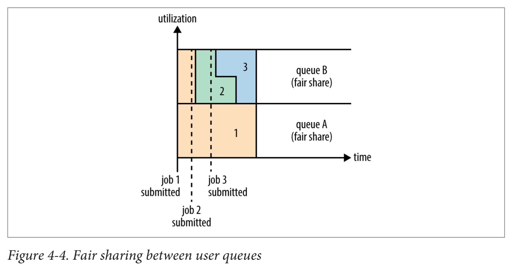

# 4 YARN

- **Y**et **A**nother **R**esource **N**egotiator
- 하둡의 클러스터 자원 관리 시스템

### API
- 자원 요청 및 사용을 위해 API 제공
- 사용자 코드에서 직접 사용은 불가능
- YARN이 내장된 분산 컴퓨팅 프레임워크(Spark, Tez, Hive, Hbase등)에서 고수준 API를 작성
    - 자원 관리의 자세한 내용을 사용자가 알 수 없음


## 4.1 Anatomy of a YARN Application Run
- RM, NM: 두가지 핵심 장기 실행 데몬
    - **Resource Manager**: 클러스터 전체 자원의 사용량 관리
    - **Node Manager**: 컨테이너를 구동 & 모니터링
- Container: 메모리, CPU등 자원의 사용 한도를 가진 특정 어플리케이션이 실행되는 주체
    - Unix프로세스 또는 Linux cgroup
- YARN application은 하둡 RPC와 같은 원격 호출 방식을 이용하여 상태 변경을 전달하고 클라이언트로부터 결과를 받음
    - application마다 구체적인 구현이 다름


1. Application Master 구동 요청 (client -> RM)
1. 컨테이너에서 Application Master를 구동할 수 있는 NM을 하나 찾음
1. 어플리케이션 수행
    - 단순한 계산: 단일 컨테이너(해당 AM)에서 수행 후 자원 반납
    - 맵리듀스 등: RM에 더 많은 자원 요청 및 할당 후 분산처리

### 4.1.1 Request Resources
#### 유연한 자원 요청 모델
##### Locality Constraint
- 다수의 컨테이너 요청시 각 컨테이너별 필요 자원(CPU, 메모리) 뿐 아니라 지역성 제약도 표현 가능
- 네트워크 대역폭의 효과적인 관리 가능
- 특정 노드나, 랙 또는 클러스터의 다른 곳 (외부 랙)에 컨테이너 요청 시 사용
- 느슨한 적용: 할당 실패 혹은 노드 자원 부족시 적용
    - 현재 노드 -> 동일한 랙의 다른 노드 -> 클러스터의 임의 노드

##### Dynamic Resource Allocation
- application이 처음 모든 자원을 요청
    - 고정된 개수의 executor를 시작
- application 실행중 필요에 의해 동적으로 자원을 추가요청 가능
    - 맵리듀스 등: 필요한 Map태스크 컨테이너 요청 -> 어느정도 Map 스테이지가 끝난 후 Reduce 태스크 컨테이너 요청 및 할당
    - 특정 태스크 실패시 재실행을 위한 컨테이너 추가 요청

### 4.1.2 어플리케이션의 수명
- 실행시간보다 사용자가 실행하는 잡의 방식에 따라 application을 분류하는 것이 더 효율적
    - 수행시간이 짧게는 수초 ~ 길게는 수일/수개월

1. 사용자의 job당 하나의 application 실행
    - map-reduce
1. workflow나 사용자의 job session 당 하나의 application 실행
    - 1의 방식보다 훨씬 효율적: 순차적으로 실행되는 잡이 동일한 컨테이너 재사용 가능
    - job 사이에 공유 데이터 캐싱 가능
    - spark
1. 서로 다른 사용자들이 공유할 수 있는 장기 application
    - 코디네이션 역할을 수행하기도 함
    - 빠른 구동시간: 새로운 Application Master 구동시 오버헤드를 피할 수 있음
    - apache slider: 클러스터에서 다양한 어플리케이션을 구동시키는 장기 실행 Application Master가 있음
    - impala: 여러 임팔라 데몬이 클러스터 자원을 요청할 수 있도록 프록시 application을 제공

### 4.1.3 YARN 어플리케이션 만들기
- 맨땅에 YARN application을 만들기는 매우 어려움 -> 기존 프레임워크 활용 추천
    - DAG 실행: Spark / Tez
    - Streaming: Spark-streaming / Samza / Storm

#### Apache Slider
- YARN application을 쉽게 만들 수 있도록 지원
- 기존의 분산 application을 YARN위에서 실행하도록 도와줌
- Hbase와 같은 자신의 application instance를 다른 사용자와 상관 없이 클러스터에서 수행 가능
    - 동일한 application의 서로 다른 버전도 실행 가능
- application이 실행되는 노드의 수를 변경하거나, 실제 application을 중지하고 다시 시작하도록 제어 가능

#### Apache Twill
- Apache Slider와 비슷
- YARN에서 수행되는 분산 application을 개발할 수 있는 간단한 프로그래밍 모델 제공
    - JAVA의 `Runnable` 객체를 확장한 클러스터 프로세스를 정의 후
    - 클러스터의 YARN 컨테이너에서 이를 실행하는 기능 제공
- 실시간 로깅 및 명령 메시지 기능 제공
    - logging: `runnables`의 로그 이벤터를 클라이언트에 스트리밍으로 리턴
    - command message: 클라이언트에서 `runnable`로 전송

#### Distributed Shell
- YARN 프로젝트의 일부로 제공
- 복잡한 스케줄링 요구사항이 존재하는 경우
- client 또는 Application Master가 YARN 데몬과 통신하기 위한 YARN Client API 사용 예제 제공

## 4.2 YARN Compared to MapReduce 1
#### MapReduce1
- 하나의 **Job Tracker**와 하나 이상의 **Task Tracker**로 job의 실행과정 제어
- JobTracker
    - 여러 TaskTracker에서 실행되는 task를 스케줄링
    - 시스템에서 실행되는 모든 job을 조율
- TaskTracker
    - task를 실행하고 진행 상황을 JobTracker에게 전송 => JobTracker가 진행상황 파악 가능
- task실패시 JobTracker는 다른 TaskTracker에게 그 task를 다시 스케줄링

#### YARN
- MR1의 JobTracker가 하던 역할을 분담
- **Resource Manager** && **Application Master**
    - scheduling과 monitoring
- **Timeline Server**
    - 별도의 데몬을 통해 실행
    - 완료된 job에 대한 histroy logging

##### Comparing MR1 & Yarn component
| MR1 | Yarn |
| --- | --- |
| JobTracker | Resource Manager, Application Master, Timeline Server |
| TaskTracker | Node Manager |
| Slot | Container |

### YARN의 장점
#### Scalability
- MapReduce 보다 큰 클러스터에서 실행 가능
- MR은 4,000 node 혹은 40,000 task 를 넘어가면 병목현상 발생
- JobTracker가 job, task 모두를 관리하기 때문
- YARN은 이를 ResourceManager와 ApplicationMaster로 분리했기 때문에 극복 가능
- 10,000 nodes & 100,000 tasks

#### Availability
- 서비스 데몬의 상태 정보를 항시 복사해 두는 방법으로 구현
- MR: JobTracker의 메모리에 있는 복잡한 상태정보가 매우 빠르게 변경하기에 구현이 어려움
- YARN에서는 RM + AM 형태로 역할이 나뉘었기에, HA가 Divide and Conquer 형태의 문제로 바뀜
    - 먼저 RM의 HA를 제공한 후 YARN application을 지원
    - 하둡2는 ResourceManager와 MR job을 위한ApplicationMaster 모두에 HA를 제공 [See 7.2 실패](#7.1)

#### Utilization
- MR1에서 각 TaskTracker는 map slot과 reduce slot으로 구분된 고정 크기 **slot**의 정적 할당 설정을 가지고 있음
    - 각 슬롯은 정해진 역할(map/reduce)을 수행하기 위해서만 사용
- YARN의 NodeManager는 정해진 갯수의 슬롯 대신 일종의 **Resource Pool**을 관리
    - map slot은 남아 돌지만 reduce slot이 꽉 차서 reduce를 위해 마냥 기다리는 비효율 적인 상황은 발생하지 않음
    - task를 실행할 수 있는 자원이 있으면, application은 그 자원을 받을 자격이 있음
- YARN의 작업은 잘게 쪼개져 있기 때문에, application은 필요한 만큼 자원 요청 가능
    - 기존에는 개별 slot을 사용했기에, 특정 task를 위해 너무 많거나(낭비) 너무 적게(실패의 원인)자원을 할당하는 경우가 있음

#### Multitenancy
- MR을 뛰어넘어 다양한 분산 application을 수용할 수 있음
    - MR은 YARN의 다양한 application중 하나일 뿐
- 사용자는 서로 다른 버전의 MR을 동일한 YARN 클러스터에서 수행하는것도 가능
    - MR1 -> MR2 등으로 업그레이드 과정을 관리하기 쉽게 만듦
    - but> job history server 나 shuffle handler 같은 일부 MR이나 YARN 자신은 업그레이드를 하려면 별도의 이중화된 클러스터가 여전히 필요

## 4.3 YARN 스케줄링
- 제한된 자원 하에서 정해진 정책에 따라 application에 자원의 할당이 필요
- **BEST** 는 있기 힘듦으로 YARN은 여러가지 옵션을 마련해서 사용자가 직접 선택할 수 있도록 함

### 4.3.1 스케줄러 옵션
- FIFO, Capacity, Fair 등의 스케줄러 제공
    - FIFO: 이해가 쉽고 설정이 불필요하지만 공유 클러스터 환경에서는 부적합
    - Capacity나 Fair 스케줄러는 장시간 수행 잡을 처리하는 도중에 작은 비정형 질의도 중간에 실행하여 적당한 시간에 결과를 얻을 수 있음


1. FIFO는 대형 잡이 완료될 때 까지 작은 job은 대기
1. Capacity는 작은 job을 제출하는 즉시 분리된 전용 큐에서 처리
    - 해당 큐는 자원을 선점하기에 전체 클러스터의 효율은 떨어짐
    - 대형 job은 FIFO에 비해 처리시간이 더 오래 걸림 (다른 job이 없더라도!)
1. Fair는 실행중인 모든 잡의 자원을 동적으로 분배
    - 미리 자원의 가용량을 예약할 필요 없음
    - 대형 job이 먼저 시작되면 실행중인 job이 하나밖에 없기 때문에 클러스터의 모든 자원을 얻을 수 있음
    - 중간에 작은 job이 추가되면 페어 스케줄러는 자원의 절반을 할당하여 처리
    - 작은 job이 완료된 후 더 자원 요청이 없기 떄문에 스케줄러는 반납된 자원을 대형 job 처리에 재할당

### 4.3.2 Capacity Scheduler Configuration
- 회사의 조직 체계에 맞게 하둡 클러스터를 공유 가능
    - 전체 클러스터의 지정된 가용량을 미리 할당
    - 조직내 서로 다른 사용자 그룹 사이에도 가용량을 공유할 수 있도록 함
- 단일 큐 내부의 application들은 FIFO 방식으로 스케줄링

#### Queue Elasticity (큐 탄력성)
- 하나의 단일 잡은 해당 큐의 가용량을 넘는 자원 사용 불가
- 큐 내에 다수의 잡이 존재하고 현재 가용할 수 있는 자원이 클러스터에 남아 있다면,
    - capacity 스케줄러는 해당 큐에 있는 job을 위해 여분의 자원 할당 가능
    - Queue의 가용량 초과 지정 가능
    - `yarn.scheduler.capacity.<queue_path>.user-limit-factor`: 초과 가능한 자원 할당 옵션
- 일반적인 운용 시 Capacity 스케줄러는 컨테이너를 선점하기 위해 강제로 죽이는 방법을 사용하지 않음
    - 요청한 가용량에 미달한 큐가 있으면, 필요한 요청은 증가
    - 다른 큐의 컨테이너가 완료되어 자원이 해제된 경우에만 해당 큐에 가용량을 돌려줌
    - 다른 큐의 가용량을 너무 많이 잡아먹지 않도록 큐에 최대 가용량을 설정하여 해결

#### Configuration Example
```
root
  ├── prod
  └── dev
      ├── eng
      └── science
```
```xml
<?xml version="1.0"?>
<configuration>
    <property>
        <name>yarn.scheduler.capacity.root.queues</name>
        <value>prod,dev</value>
    </property>
    <property>
        <name>yarn.scheduler.capacity.root.dev.queues</name>
        <value>eng,science</value>
    </property>
    <property>
        <name>yarn.scheduler.capacity.root.prod.capacity</name>
        <value>40</value>
    </property>
    <property>
        <name>yarn.scheduler.capacity.root.dev.capacity</name>
        <value>60</value>
    </property>
    <property>
        <name>yarn.scheduler.capacity.root.dev.maximum-capacity</name>
        <value>75</value>
    </property>
    <property>
        <name>yarn.scheduler.capacity.root.dev.eng.capacity</name>
        <value>50</value>
    </property>
    <property>
        <name>yarn.scheduler.capacity.root.dev.science.capacity</name>
        <value>50</value>
    </property>
</configuration>

```
- `root` 아래 `prod`, `dev` 두 개의 큐가 있고 각각 40%와 60%의 가용량을 할당
- 각 큐는 `yarn.scheduler.capacity.<queue-path>.<sub-property>` 와 같은 형식으로 설정 속성을 정의
    - `<queue-path>`: `root.prod`와 같이 큐의 계층 구조 정의
- `dev` queue는 동일한 가용량을 가진 `eng`와 `science`큐로 다시 분리
- `dev`는 최대 가용량을 75%로 제한
    - `prod`가 놀고 있더라도 전체 자원을 모두 사용할 수는 없음
    - `prod`는 항상 25%의 가용량을 보장
- 다른 큐에는 최대 가용량을 지정하지 않았기에, `eng`와 `science`는 `dev`큐의 최대 가용량을 모두 사용 가능 (75%)
- `prod`는 클러스터의 전체 가용량을 사용할 수 있다 (최소 25% ~ 최대 100%)
- 할당될 자원의 최대 개수, 동시 실행 개수, ACL등의 제어도 가능 (http://bit.ly/capacity_scheduler)

#### 큐 배치
- application을 큐에 배치하는 방법은 application의 종류에 따라 달라짐
    - MR의 경우 mapreduce.job.queuename 속성에 원하는 큐의 이름 지정 가능
    - 지정한 이름의 queue가 없다면 제출 시점에 에러 발생
    - 미지정시 `default` 큐에 배치

> **CAUTION**
> Capacity 스케줄러는 계층 구조로 된 전체 이름 인식 불가
> - 계층 이름의 마지막 부분만 큐의 이름으로 사용
> - `prod`, `eng` => OK!, `root.dev.eng`, `dev.eng` => ERROR!


### 4.3.3 Fair Scheduler Configuration
- 실행중인 모든 application에 동일하게 자원을 할당
- 균등 공유는 **동일 queue 내에서만** 실제로 적용

> `Queue`와 `Pool`이란 용어는 Fair Scheduler의 맥락에서는 같은 의미로 사용

#### Example


- 사용자 A와 B 둘이 있는경우...  두 사용자는 각각 자신의 큐를 가지고 있음
- A가 먼저 job을 하나 제출한 경우 경합이 없기 때문에 전체 자원 사용
- A의 job이 끝나기 전에 B가 새로운 job을 제출한 경우 한동안 자원의 절반씩을 나누어 사용
- A, B의 job 여전히 각각 돌고 있을때 B가 job을 하나 더 제출하면 이 job은 B의 다른 job과 자원을 공유
- B의 각job은 전체 자원의 25%를 사용, A는 50%를 사용 => **사용자 사이에서만 균등하다**

#### 페어 스케줄러 활성화
- `yarn.resourcemanager.scheduler.class`에 스케줄러 설정
    - 보통 기본 스케줄러는 Capacity 이지만, CDH등 일부 배포판에서는 **Fair** 스케줄러임
- 원하는 스케줄러 지정 방법
    - File: `yarnsite.xml`
    - Key: `yarn.resourcemanager.scheduler.class`
    - Value: `org.apache.hadoop.yarn.server.resourcemanager.scheduler.fair.FairScheduler`

#### 큐 설정
- (CLASSPATH) `fair-scheduler.xml` > `yarn.scheduler.fair.allocation.file`
- 할당 파일(`fair-scheudler.xml`)이 없으면 위 설명의 기본 동작 방식을 따름
    - 각 application은 해당 사용자 이름의 큐에 배치
    - 사용자 큐는 해당 사용자가 처음 application 제출시 동적으로 생성

##### Configuration Example
```xml
<?xml version="1.0"?>
    <allocations>
        <defaultQueueSchedulingPolicy>fair</defaultQueueSchedulingPolicy>

        <queue name="prod">
            <weight>40</weight>
            <schedulingPolicy>fifo</schedulingPolicy>
        </queue>

        <queue name="dev">
            <weight>60</weight>
            <queue name="eng" />
            <queue name="science" />
        </queue>

        <queuePlacementPolicy>
            <rule name="specified" create="false" />
            <rule name="primaryGroup" create="false" />
            <rule name="default" queue="dev.eng" />
        </queuePlacementPolicy>
    </allocations>
```

- 큐의 계층 구조는 중첩된 큐 항목으로 정의
- 실제 큐는 `root`큐 항목에 중첩된 것은 아니나 모든 큐는 `root`의 자식
    - `dev`큐는 하위에 `eng`와 `science`큐로 분리
- 각 큐에 균등 공유의 비율로 적용되는 가중치 설정 가능
    - `prod`:`dev` = 40 : 60 비율로 자원 할당
    - `eng`, `science`는 가중치를 지정하지 않았기 때문에, 자원을 동등하게 할당
    - 가중치는 정확하게 100%로 설정할 필요 없음 => `prod`와 `dev`를 각각 2, 3으로 변경해도 비율이 동일
- 각 큐에 서로다른 스케줄링 정책을 설정 가능
    - 기본 정책은 최상단의 `defaultQueueSchedulingPolicy` 항목에 설정 (생략시 `FairScheduling` 적용)
    - 이름과 상관없이 FairScheduling 큐에 FIFO정책도 지원
    - DRF(Dominant Resource Firness) 정책도 사용 가능
- 특정 큐의 정책은 `schedulingPolicy` 항목으로 재정의 가능
    - 위 예제에서...
    - `prod`큐는 `FIFO` 적용:각 잡이 순차적으로 실행되고 빨리 끝나야 하기 때문
    - `prod` 큐와 `dev`큐는 자원 공유시 균등 분배 정책이 적용
    - `dev`큐의 하위에 있는 `eng`, `science` 큐에도 동일하게 적용
- 각 큐에 최대 자원 사용량과 최대 실행 application의 개수도 지정 가능 (http://bit.ly/fair_scheduler)
    - 최소 자원 사용량은 엄격한 제한이 아니라, 자원 할당의 우선순위 개념
    - 균등 공유 정책의 적용을 받는 큐가 두 개 있다면, 그 중 최소 자원 사용량이 더 큰 큐에 우선적으로 자원 할당
    - 최소 자원은 **선점(preemption)**에 활용 가능

#### 큐 배치
- Fair Scheduler는 application을 큐에 할당시 규칙 기반 시스템을 이용

##### `queuePlacementPolicy`
- 해당 규칙 목록을 포함한 설정(맞는 규칙이 나올때까지 순서대로 시도)
- `specified`
    - 지정된 큐에 application을 배치,
    - 큐를 지정하지 않거나, 지정한 큐가 존재하지않으면 이 규칙은 passing됨
- `primaryGroup`
    - 사용자의 유닉스 그룹의 이름을 가진 큐에 application 배치
    - 큐가 존재하지 않으면 자동 생성하지 않고 다음 규칙으로 passing
- `default`
    - catch-all
    - 항상 `dev.eng`큐에 application 배치

##### 생략시

```xml
<queuePlacementPolicy>
    <rule name="specified" />
    <rule name="user" />
</queuePlacementPolicy>
```

- 생략시 위와 같은 `specified`규칙이 기본 적용됨
- 큐를 명시적으로 지정하지 않으면 사용자 이름의 큐를 사용 (없는 경우 자동생성)

##### Example

```xml
<queuePlacementPolicy>
    <rule name="default" />
</queuePlacementPolicy>
```

- 모든 application을 `default`큐에 넣는 간단한 정책
- 사용자가 아닌 모든 application에 균등한 자원 공유 가능


##### 할당 파일을 사용하지 않고 정책 지정
- `yarn.scheduler.fair.user-as-default-queue` => `false`
- 사요자별 큐가 아닌 `default` 큐에 모든 application이 배치

##### 사용자가 동적으로 큐 생성 금지
- `yarn.scheduler.fair.allow-undeclared-pools` => `false`


#### 선점
- 스케줄러가 자원의 균등 공유에 위배되는 큐에서 실행중인 컨테이너를 죽일 수 있도록 허용하는 기능
    - 큐에 할당된 자원은 균등 공유 기준을 반드시 따라야 함
    - 중단된 컨테이너는 추후에 재실행되므로 클러스터의 전체 효율은 일정부분 떨어질 수 밖에 없음
- job의 시작 시간을 어느정도 예측 가능하게 만들어줌
- `yarn.scheduler.fair.preemption` => `true`
- 최소 공유 / 균등 공유 등 두 개의 선점 타임아웃 설정
    - 초 단위 설정
    - 기본값 없음
    - 둘 중 하나를 반드시 지정해야 함

##### minimum share preemption timeout (최소 공유 선점 타임아웃)
- 큐가 최소 보장 자원을 받지 못한 채 설정값을 넘기면, 스케줄러는 다른 컨테이너 선취 가능
- `defaultMinSharePreemtionTimeout`
    - 할당 파일의 최상위 항목
    - 모든 큐의 기본 타임아웃을 설정
- `minSharePreemptionTimeout`
    - 타임아웃을 개별 큐를 기준으로 설정

##### fair share preemption timeout (균등 공유 선점 타임아웃)
- 큐가 균등 공유의 **절반** 이하로 있는 시간이 설정값을 초과하면 다른 컨테이너 선취
- `defaultFairSharePreemptionTimeout` && `fairSharePreemptionTimeout`
- 임계치의 기본값은 0.5
- `defaultFairSharePreemptionThreshold` && `fairSharePreemptionThreshold` 설정값을 통해 임계치 변경 가능

### 4.3.4 Delay Scheduling
- YARN의 스케줄러는 **지역성 요청**을 가장 우선시
- 바쁜 클러스터에 어떤 application이 특정 노드를 요청하면 요청하는 시점에 그 노드에 다른 컨테이너가 실행되고 있을 가능성이 높음
    - 지역성 요구 수준을 조금 낮춘 후 동일한 랙에 컨테이너를 할당하는 방법
    - but, 조금만 기다리면 요청한 지정 노드에서 컨테이너를 할당받을 수 있는 기회가 급경히 증가하는 경우가 많음
    - 클러스터의 효율성도 높아짐

> **heartbeat**
> - 노드 매니저가 실행중인 컨테이너의 정보와 새로운 컨테이너를 위한 가용한 자원에 대한 정보 교환
> - YARN의 모든 노드 매니저는 주기적으로 RM에 heartbeat 요청
> - 각 hearbeat는 application이 실행할 컨테이너를 얻을 수 있는 중요한 **스케줄링 기회**

- 지연 스케줄링 사용시 처음 오는 스케줄링 기회를 바로 사용하지 않음
    - 지역성 제약 수준을 낮추기 전에 허용하는 최대 횟수까지 기다린 후 그 다음에 오는 스케줄링 기회를 취득

#### Delay scheduling in Capacity Scheduler
- `yarn.scheduler.capacity.node-localty-delay` 속성에서 양의 정수를 지정
    - 스케줄링 기회의 횟수
    - 지연 스케줄링이 실행시 동일한 랙의 다른 노드를 찾도록 제약 수준을 낮추는 기회 상실

#### Delay scheduling in Fair Scheduler
- 스케줄링 기회의 횟수를 클러스터 크기의 비율로도 지정 가능
- `yarn.scheduler.fair.locality.threshold.node`
    - value가 0.5인 경우: 클러스터 전체 노드의 절반에 해당하는 스케줄링 기회가 올 때까지 대기 후
    - 동일한 랙의 다른 노드 허용
- `yarn.scheduler.fair.locality.threshold.rack`
    - `yarn.scheduler.fair.locality.threshold.node` 와 대응하는 속성
    - 요청한 랙 대신 다른 랙을 허용하는 임계치 설정


### 4.3.5 Dominant Resource Fairness
- 우성 자원 공평성
- 메모리와 같은 단일 유형의 자원을 분배시 가용량이나 공평성의 개념을 결정하는것은 간단한 문제
    - 두 사용자가 application 실행시 메모리양을 기준으로 쉽게 비교 가능
- 다수의 자원이 있는 경우 복잡도 상승
    - CPU를 많이 쓰고 메모리를 적게 쓰는 application && CPU를 적게 쓰고 메모리를 많이 쓰는 application ??
- **DRF: 각 사용자의 우세한 자원을 확인 후 이를 클러스터의 사용량 기준으로 설정**
    - 클러스터의 전체 CPU는 100개 & 10TB 메모리
    - A: CPU 2개 + 메모리 300G => CPU: 2%, Memory: 3% => Memory 우세
    - B: CPU 6개 + 메모리 100G => CPU: 6%, Memory: 1% => CPU 우세
    - 컨테이너 B의 요청을 **우세 자원** 기준으로 보면 **2배 높음**
    - 균등 공유 정책을 따르면 **A는 B의 절반에 해당하는 자원을 할당**
- DRF는 기본적으로 비활성화
    - 자원 계산시 CPU는 무시되고, 메모리만 고려됨
- DRF in Capacity Scheduler
    - `capacityscheduler.xml`
    - > `yarn.scheduler.capacity.resource-calculator`
    - >>`org.apache.hadoop.yarn.util.resource.DominantResourceCalculator`
- DRF in Fair Scheduler
    - `defaultQueueSchedulingPolicy` => `drf`로 지정


